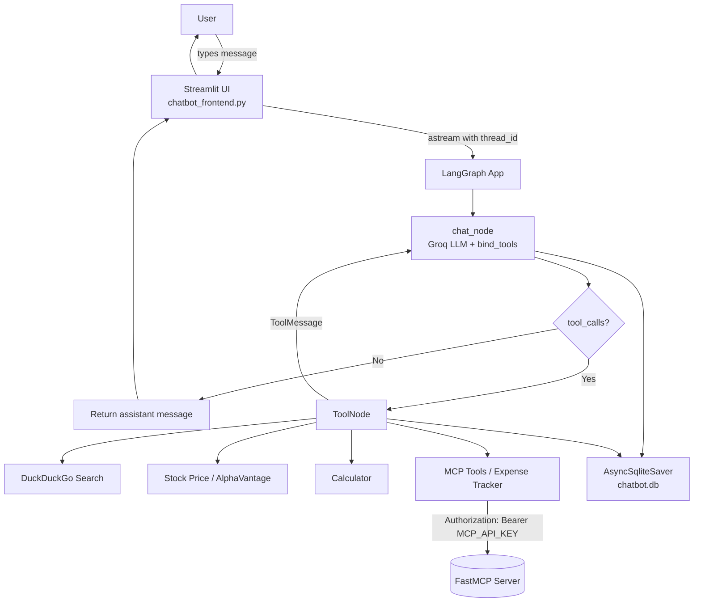

# Conversational Chatbot

A persistent, multi-tool conversational chatbot built with **LangGraph**, **Streamlit**, and **MCP**.

[](https://youtu.be/zccNkBaQmko)

---

## Features

- **Persistent chat history** — conversations survive app restarts via SQLite checkpointing (per `thread_id`)
- **Tool calling** — LLM can invoke web search, stock prices, a calculator, and remote MCP tools
- **Remote MCP integration** — connects to a FastMCP expense tracker server with Bearer auth
- **Multi-thread UI** — sidebar lists and restores past conversations

---

## Project Structure

```
chatbot/
├── chatbot_frontend.py        # Streamlit UI (chat interface + conversation sidebar)
├── chatbot_backend_sqlite.py  # LangGraph graph, tool loading, SQLite checkpointing
└── chatbot.db                 # SQLite database (auto-created; stores conversation state)
```

---

## Quickstart

### 1. Install dependencies

```bash
pip install -r requirements.txt
```

### 2. Configure environment variables

Create a `.env` file in the project root:

```env
# Required
GROQ_API_KEY=...           # LLM provider
MCP_API_KEY=...            # Remote MCP server (FastMCP) auth
ALPHAVANTAGE_API_KEY=...   # Stock price tool

# Optional
OPENAI_API_KEY=...
GOOGLE_API_KEY=...
HUGGINGFACEHUB_ACCESS_TOKEN=...

# LangSmith tracing (optional)
LANGSMITH_TRACING=true
LANGSMITH_ENDPOINT=https://api.smith.langchain.com
LANGSMITH_API_KEY=...
LANGSMITH_PROJECT=ChatBot-Project
```

### 3. Run the app

```bash
streamlit run chatbot/chatbot_frontend.py
```

---

## How It Works

### Conversation threads

Each chat session gets a unique `thread_id` (UUID). The sidebar lists all existing threads; clicking one restores its full message history via `chatbot.get_state({"configurable": {"thread_id": ...}})`. State is persisted using `AsyncSqliteSaver` backed by `chatbot/chatbot.db`.

### LangGraph graph

The backend compiles a two-node graph:

- **`chat_node`** — calls the Groq LLM with tools bound via `bind_tools`
- **`tools` (ToolNode)** — executes any tool calls the model emits, then loops back to `chat_node`

### Available tools

| Tool | Source |
|---|---|
| DuckDuckGo search | `DuckDuckGoSearchRun` |
| Stock price | AlphaVantage API |
| Calculator | Local function |
| Expense tracker | Remote FastMCP server (`https://efficient-purple-snipe.fastmcp.app/mcp`) |

MCP tools are loaded via `MultiServerMCPClient`. If they fail to load (auth error, network issue), the app falls back gracefully to the remaining tools.

---

## Architecture



---

## Troubleshooting

**MCP tools not loading** — verify `MCP_API_KEY` is set and `https://efficient-purple-snipe.fastmcp.app/mcp` is reachable.

**Stock price errors** — check that `ALPHAVANTAGE_API_KEY` is valid and not rate-limited.

**Lost conversations** — chat history lives in `chatbot/chatbot.db`. Deleting this file clears all threads.